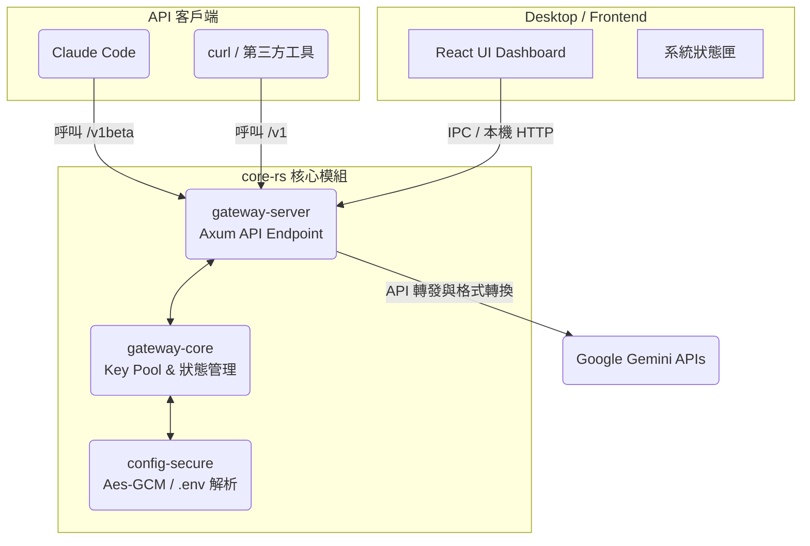

# Gemini Balance Desktop (Rust + Tauri) 架構說明

本文件旨在協助開發人員快速理解 `gemini-pool-proxy` 專案如何透過 Rust 結合 Tauri 實現現代化、低延遲的本機 API 代理服務。

## 🎯 核心設計目標

- 以極低延遲的 **Rust (`core-rs`)** 取代原本笨重的 Go / Python 後端 runtime。
- 以 **Tauri** (`desktop/tauri-app`) 提供跨平台（以 macOS 為主）的原生 GUI 系統狀態列與視覺化管理介面。
- 安全至上：預設僅綁定本機 `127.0.0.1` 進行請求轉發，杜絕隨意暴露在公網的風險。

## 🏗️ 系統架構流

整個專案由三個主要領域構成：**桌面殼層(Tauri)**、**代理伺服器(Gateway)**與**核心業務(Core)**。



## 📂 目錄模組詳解

- **`core-rs/crates/gateway-core`**: 封裝負載平衡算法 (`PoolStrategy`)、連線狀態、各種資料與 API Payload 轉換的型別模型 (types definition)。
- **`core-rs/crates/gateway-server`**: 取用 Axum 生態建立的高效能 HTTP 入口，處理 `/api/v1/*` (管理層) 與 `/v1/*`, `/v1beta` (串流代理層)。
- **`core-rs/crates/config-secure`**: 輕量化設定解析。負責載入 `.env` 檔案設定參數，並支援搭配 Keychain 與 AES-GCM 安全儲存特定敏感變數。
- **`desktop/tauri-app`**: 
  - 提供 React + Vite 的網頁介面。
  - 管理 Rust Backend Sidecar（以子進程模式維護 `gateway-server` 的啟動及終止）。

## ⚙️ 環境設定載入機制 (.env)

專案仰賴目錄下的 `.env` 作為起始配置點。這些設定在系統初始化時，由 `config.rs` 獨家負責讀取並推入記憶體。

> [!NOTE]
> 開發者請參閱與原始碼對齊的 `.env.example`，裡面詳細記錄了所有支援的欄位字串（包含 `AUTH_TOKEN`, `MODEL_POOLS` 及不同模型的自定義參數如 `THINKING_MODELS`）。當開發中新增環境變數時，必須同步修改 `core-rs/crates/gateway-server/src/config.rs` 以建立正確映射。

## 🚀 開發與編譯

**啟動整合版桌面與代理服務**
```bash
./start-desktop.sh
```
> `start-desktop.sh` 會強制使用 rustup stable toolchain 進行編譯與啟動，避免 PATH 上被劫持造成 Tauri CLI panic。

**僅在 Terminal 單獨測試 Rust API**
```bash
cd core-rs
rustup run stable cargo run -p gateway-server
```

## 🔗 重點 API 路由彙整

**管理專用 (`/api/v1/*`)**
- `POST /api/v1/session/login`
- `GET /api/v1/dashboard/overview`
- `GET /api/v1/keys`
- `POST /api/v1/keys/actions`
- `GET|PUT /api/v1/config`
- `GET /api/v1/pool/status`
- `PUT /api/v1/pool/strategy`

**代理專用 (`/v1/*` 與 `/v1beta/*`)**
- `GET /v1/models`
- `POST /v1/chat/completions` (OpenAI 格式自動轉譯)
- `/v1beta/models/{model}:generateContent` (原生 Gemini 完全通透反向代理)

> [!WARNING]
> 相容層棄用說明：`/api/v2/*` 與 `/v2/*` 已完全停用，舊版客戶端若請求此類路徑將統一回覆 `410 Gone` 並附帶強制遷移訊息。
