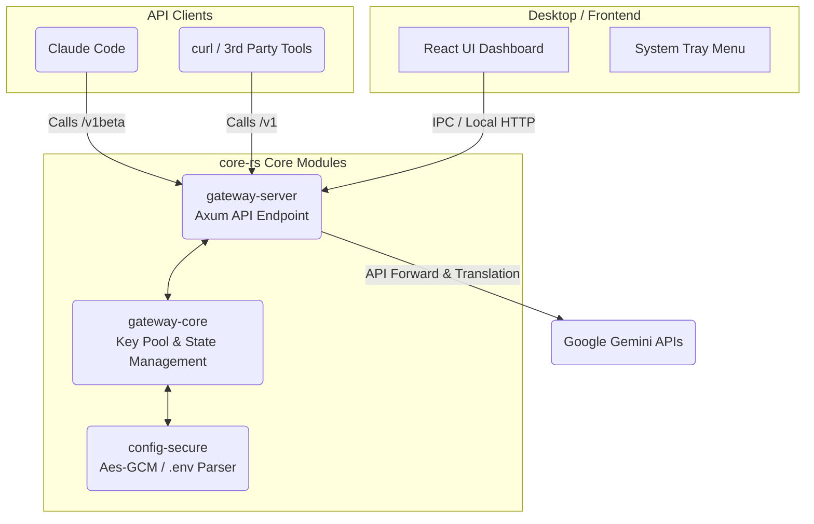

# Gemini Balance Desktop (Rust + Tauri) Architecture

This document is designed to help developers quickly understand how `gemini-pool-proxy` implements a modern, low-latency local API proxy service combining Rust and Tauri.

## 🎯 Core Design Goals

- Replace the bulky Go/Python backend runtimes with extremely low-latency **Rust (`core-rs`)**.
- Provide a cross-platform (macOS prioritized) native GUI system tray and visual management dashboard via **Tauri (`desktop/tauri-app`)**.
- Security first: By default, the proxy binds only to localhost `127.0.0.1` for request forwarding, preventing public exposure risks.

## 🏗️ System Architecture Flow

The entire project is composed of three main domains: **Desktop Shell (Tauri)**, **Proxy Server (Gateway)**, and **Core Business Logic (Core)**.



## 📂 Module Directory Details

- **`core-rs/crates/gateway-core`**: Encapsulates load balancing algorithms (`PoolStrategy`), connection state, and models mapping/translating different API Payloads.
- **`core-rs/crates/gateway-server`**: High-performance HTTP entry point built with the Axum ecosystem, handling `/api/v1/*` (management tier) and `/v1/*`, `/v1beta` (streaming proxy tier).
- **`core-rs/crates/config-secure`**: Lightweight configuration parser. Loads parameters from the `.env` file and supports AES-GCM secure storage via Keychain for sensitive variables.
- **`desktop/tauri-app`**: 
  - Delivers a web-based dashboard using React + Vite.
  - Manages the Rust Backend Sidecar (controls start/termination lifecycle of the `gateway-server` sub-process).

## ⚙️ Environment Configuration (.env)

The project relies on `.env` in the root directory as its initial configuration point. These variables are loaded into memory exclusively via `config.rs` during system bootstrapping.

> [!NOTE]
> Developers should refer to `.env.example`, which details all supported fields (including `AUTH_TOKEN`, `MODEL_POOLS`, and model settings like `THINKING_MODELS`). Whenever altering environment settings, ensure you update `core-rs/crates/gateway-server/src/config.rs` to maintain accurate logic mapping.

## 🚀 Development & Compilation

**Run Integrated Desktop & Proxy Service**
```bash
./start-desktop.sh
```
> `start-desktop.sh` forces the use of the `rustup stable` toolchain for compilation, preventing unexpected path hijacking and Tauri CLI panics.

**Run Rust API Server Alone in Terminal**
```bash
cd core-rs
rustup run stable cargo run -p gateway-server
```

## 🔗 Key API Routes Summary

**Management Only (`/api/v1/*`)**
- `POST /api/v1/session/login`
- `GET /api/v1/dashboard/overview`
- `GET /api/v1/keys`
- `POST /api/v1/keys/actions`
- `GET|PUT /api/v1/config`
- `GET /api/v1/pool/status`
- `PUT /api/v1/pool/strategy`

**Proxy Only (`/v1/*` and `/v1beta/*`)**
- `GET /v1/models`
- `POST /v1/chat/completions` (OpenAI format automatic translation)
- `/v1beta/models/{model}:generateContent` (Native Gemini completely transparent proxy)

> [!WARNING]
> Compatibility Layer Deprecation: `/api/v2/*` and `/v2/*` are deprecated entirely. Legacy clients requesting these paths will systematically receive a `410 Gone` response alongside a forceful migration message.
